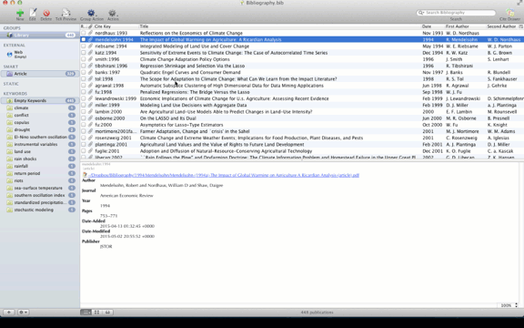

These are some Keyboard Maestro macros I adapted according to my needs. Read the comments in macros for more information. If you want you can use associated popclip extensions at [emraher/popclipextensions](https://github.com/emraher/popclipextensions)

###SkimToDTPO
The following gif gives an idea how SkimToDTPO macro works.

###Change pdf Metadata
This macro works with [BibDesk](http://bibdesk.sourceforge.net/). It requires [exiftool](http://www.sno.phy.queensu.ca/~phil/exiftool/), [Growl](http://growl.info/), and the shell script named [changemetadata.sh](https://github.com/emraher/KMmacros/blob/master/changemetadata.sh)

After you download the shell script change permissions. You may also need to change the first line of the script if you don't use zsh.

In KM macro choose the path of the shell script.

###Capitalize All
This one is a combination of various applescripts of [Christiaan Hofman](http://www.physics.rutgers.edu/~hofman/applescript/) 